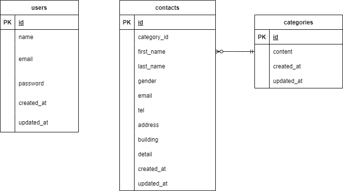

# アプリケーション名
　お問い合わせフォーム  

## 環境構築
  1.git clone git@github.com:HodakaAnzai/contact-form-test.git  
  2.DockerDesktopを起動  
  3.クローンしたconfirmation-contact-firmプロジェクト上で、以下のコードを実行してください。  
　　docker-compose up -d --build  
    code .  
  4.Laravel のパッケージのインストール  
    docker-compose exec php bash  

    composer -v  

  5.env ファイルの作成  
    cp .env.example .env  
  6.envファイルの11行目以降を以下のように修正  
  DB_CONNECTION=mysql  
  DB_HOST=mysql  
　DB_PORT=3306  
  DB_DATABASE=laravel_db  
  DB_USERNAME=laravel_user  
  DB_PASSWORD=laravel_pass  
  7.アプリケーションキーの作成  
  php artisan key:generate  

## 使用技術(実行環境)
  php 8.4.1  
  laravel 8.83.29  
  mysql:8.0.26  

## ER図

## URL
・開発環境：http://localhost/  
・phpMyAdmin:http://localhost:8080/  

　お問い合わせフォーム入力ページ
　/  
　お問い合わせフォーム確認ページ
　/confirm  
　サンクスページ
　/thanks  
　管理画面
　/admin  
　新規登録
　/register  
　ログイン
　/login  
